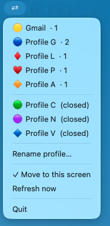

# Chrome Hopping

> Switch between Chrome profiles instantly from your macOS menu bar.

If you use multiple Google accounts — work, freelance, personal — Chrome creates a completely separate browser instance for each one. Chrome Hopping lives in your menu bar and lets you jump between them in one click or one keystroke.



---

## Install

### Option A — Homebrew (recommended)

```bash
brew install tito-sec/chrome-hopping/chrome-hopping
```

Then launch it:

```bash
chrome-hopping &
```

The **⇄** icon appears in your menu bar. It will start automatically every time you log in.

### Option B — Manual

```bash
git clone https://github.com/tito-sec/chrome_hopping.git
cd chrome_hopping
chmod +x install.sh
./install.sh
```

Requirements: macOS 12+, Google Chrome, Python 3.10+

---

## First-time permissions

macOS will ask for two permissions the first time you use it:

| Permission | Why |
|---|---|
| **Accessibility** | To bring Chrome windows to the front |
| **Full Disk Access** | To read your Chrome profile list |

Go to **System Settings → Privacy & Security** and add Terminal to both lists.

---

## How to use

| What you want to do | How |
|---|---|
| Switch to a profile | Click **⇄** in the menu bar → click the profile name |
| Cycle profiles with keyboard | Press **⌘§** |
| Open a profile that's not running | Click it — Chrome launches automatically |
| Rename a profile | **⇄** → Rename profile… |
| Refresh the profile list | **⇄** → Refresh now |
| Move windows to your current screen | **⇄** → Move to this screen |

---

## Uninstall

**If installed via Homebrew:**
```bash
launchctl bootout gui/$(id -u) ~/Library/LaunchAgents/com.chrome-hopping.plist 2>/dev/null; true
brew uninstall chrome-hopping
rm -rf ~/.chrome-hopping ~/.chrome-hopping-custom-names.json \
       ~/.chrome-hopping-usage.json \
       ~/Library/LaunchAgents/com.chrome-hopping.plist
```

**If installed manually:**
```bash
launchctl bootout gui/$(id -u) ~/Library/LaunchAgents/com.chrome-hopping.plist 2>/dev/null; true
rm -rf ~/.chrome-hopping ~/.chrome-hopping-custom-names.json ~/.chrome-hopping-usage.json
rm ~/Library/LaunchAgents/com.chrome-hopping.plist
```

---

## Troubleshooting

**⇄ icon doesn't appear after install**
```bash
chrome-hopping &
```

**Profiles not detected** — Terminal needs Full Disk Access:
System Settings → Privacy & Security → Full Disk Access → add Terminal

**⌘§ hotkey doesn't work** — Terminal needs Accessibility:
System Settings → Privacy & Security → Accessibility → add Terminal

**Windows don't come to front** — same as above, Accessibility permission needed

---

## How it works

Chrome labels each window with the profile name in the title bar. Chrome Hopping reads that label via System Events and matches it to your profile list in `~/Library/Application Support/Google/Chrome/Local State`. When you click a profile, it raises each matching window and moves it to your current screen.

---

## Contributing

Issues and PRs welcome. The entire app is a single Python file — [switcher.py](switcher.py).

---

## License

[PolyForm Noncommercial 1.0.0](LICENSE) — free for personal use, all commercial rights reserved.
